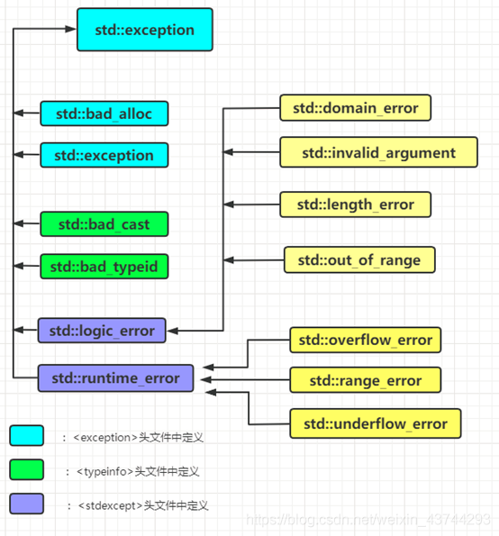

# 异常

## 基本概念

C++中使用异常处理主要目的是使得程序更加强健，稳定，遇到异常时不至于崩溃

C++中异常处理主要涉及三个关键字throw、try、catch。
* throw: 当问题出现时，程序会抛出一个异常。这是通过使用 throw 关键字来完成的。
* catch: 在您想要处理问题的地方，通过异常处理程序捕获异常。catch 关键字用于捕获异常。
* try: try 块中的代码标识将被激活的特定异常。它后面通常跟着一个或多个 catch 块。


## 异常抛出

"异常抛出"全句是"异常对象的抛出"，我们用`throw`来抛出异常对象。

异常对象：用于表示异常对象，它可以是任何类型，例如是一条异常字符串等`const char *s`，也就是说此处的异常对象本质就是普通对象，只是它们会在出现异常时被`throw`抛出.

我们抛出的异常对象会被对应的`catch`语句捕获，然后处理。具体如何捕获和处理放在后面说。

例如：有如下代码
```cpp
    for(int i = 10;i>=-10;i--)
    {
        if(i==0)
            throw "Divide 0 error";
        printf("%d/%d=%d\n",10,i,10/i);
    }
```
很明显我们发现除数为0时就抛出了异常，此时所在函数会去查看本函数中是否有对应的处理语句，如果没有就会进行函数返回。


## 异常捕获与处理
### try - catch语句和处理流程 
我们用try - catch语句进行异常的捕获与处理
格式如下：
```cpp
try
{   //try和catch括号必须写
    //可能产生异常的代码，也就是说，此处可能会抛出异常
}
catch(Type1 e)//捕获类型为Type1的异常对象
{
    //处理异常对象e
}
catch(Type2& e)//捕获类型为Type2的异常对象的引用
{
    //处理异常对象e
}
......
```


异常大致处理流程：（不太详细，具体多看例子）
1. 执行可能会产生异常的代码时，也就是含有throw的代码时。
2. 当抛出了异常，若此代码外部有try-catch语句，且catch中有对应的类型，就会在本函数中处理异常；
3. 若不符合2，就会把异常抛出本函数，并且把控制权交到调用函数手上；若调用函数中有try-catch语句，且catch中有对应的类型，就会在调用函数中处理异常，否则就会再次交出控制权并抛出异常。要是一直没有对应的catch，就会一直抛出异常并控制权到上一层，最终使得main函数把控制权交还给系统，程序结束。
4. 上述过程中，需要注意这几点：
    * 当程序寻找catch语句时，且有多个catch语句时，程序会按照代码中从上到下的顺序逐个匹配catch块的类型。
    *  对于类对象，**若catch的是值**，父类的catch可以捕获子类的异常对象，此时捕获的对象就是父类的对象，无多态性，所以若子类有特有的异常处理方式，根据上一条，应该把子类的catch写在父类前面。**若catch的是引用**，父类也可以捕获子类对象，但此时所捕获的对象会出现多态性，可以调用各自的虚函数。
    * throw异常到调用函数，这是程序控制权的转移到调用函数，而不是程序返回回到调用函数，这与C++底层有关。
    * 析构函数中抛出异常是非常危险的行为，谨慎使用


异常处理一般遵循的原则：
1. 异常处理应该尽可能地保证对程序状态的还原，以免造成不可预料的后果。
2. 在catch块中，应该尽量避免再次抛出异常，因为这可能会导致资源泄露和程序未知的行为。
3. 在多线程程序中，异常的处理方式与单线程略有不同，需要特别注意线程间的异常传递机制。
4. 对于标准库函数，也都提供了相应的异常处理方式，需要查阅文档学习并加以应用。
5. 需要在程序中养成良好的异常处理习惯，这样才能使程序更加健壮、可靠。

### 例1
```cpp
#include <iostream>

void fun()
{
    for(int i = 3;i>=-3;i--)
    {
        if(i==0)
            throw "Divide 0 error";
        printf("%d/%d=%d\n",10,i,10/i);
    }
}

int main()
{
    try 
    {
        fun();
        printf("Fun next\n");
    }
    catch(const char *s)
    {
        printf("Here is Error:%s\n",s);
    }
    printf("End of Main");
}
```
**执行过程**：
1. main函数中先执行try中语句，也就是fun();
2. 进入fun函数后，i从3开始递减到-3，且i做除数，所以当i等于0时就不合理了，所以需要抛出异常，此处我们抛出一个常量字符串表示异常信息。
3. 当抛出异常时，发现fun函数中没有对应于常量字符串异常类型的处理语句，也就是没有对应catch块，所以此时fun函数把控制权交给main，并且把异常抛出到main中。
4. main函数中在fun的位置抛出了一个常量字符串类型的异常，立刻去catch检查，发现有对应的catch块，此时处理异常执行`printf("Here is Error:%s\n",s);`
5. 处理完成之后try - catch块就结束了，也就是说不会执行`printf("Fun next\n");`，try-catch块结束后，继续执行程序，也就是`printf("End of Main");`

**执行结果**：
```
10/3=3
10/2=5
10/1=10
Here is Error:Divide 0 error
End of Main
```


### 例2

```cpp
#include <iostream>

void fun()
{
    try
    {
        for(int i = 3;i>=-3;i--)
        {
            if(i==0)
                throw "Divide 0 error";
            printf("%d/%d=%d\n",10,i,10/i);
        }
    }
    catch(const char *s)
    {
        printf("Here is Error 1:%s\n",s);
    }
}

int main()
{
    try 
    {
        fun();
        printf("Fun next\n");
    }
    catch(const char *s)
    {
        printf("Here is Error 2:%s\n",s);
    }
    printf("End of Main");
}
```
**执行过程**：
1. main函数中先执行try中语句，也就是fun();
2. 进入fun函数后，执行到抛出异常，抛出的是常量字符串类型异常。
3. 抛出异常时，发现抛出异常的位置就在try - catch块中
4. 所以当前的catch直接捕获了常量字符串类型异常，之后进行异常处理，执行`printf("Here is Error 1:%s\n",s);`。
5. 处理完异常后，fun中的那个try-catch块结束，此时fun函数也结束了，所以返回main函数
6. 由于异常已经被fun处理过了，所以main函数中不会处理异常也就是不会执行`printf("Here is Error 2:%s\n",s);`。此时main函数中fun函数执行完成，执行下一句`printf("Fun next\n");`
7. main中的try-catch 块结束了，执行下一句`printf("End of Main");`


**执行结果**：
```
10/3=3
10/2=5
10/1=10
Here is Error 1:Divide 0 error
Fun next
End of Main
```


## 自定义异常类型
C++中我们可以自己定义异常类型

### 例3
```cpp
#include <iostream>
#include <string>

using std::cin;
using std::cout;
using std::endl;
using std::string;

class TooBigError
{
public:
    virtual void printError(int n) const//写成虚函数方便以后子类覆盖
    {
        cout<<"Number "<<n<<" is too Big"<<endl;
    };
};


void Get_number(int n)
{
    if(n>=1000)
        throw TooBigError();
    else
        cout << "Your number below 1000 is "<<n<<endl;;
}


int main()
{
    while(1)
    {
        cout<<"Plase input a number below 100"<<endl;
        int n;
        cin>>n;
        try
        {
            Get_number(n);
        }
        catch(TooBigError &e)
        {
            e.printError(n);
            exit(1);
        }
    }
}
```
上述代码检查输入是否是小于1000的数字
*本例还是不太严谨，例如没有检查输入的是不是字符，但是这个只是个例子，主要是了解如何定义异常类型，但是在实际工程中要排除一切不合理的输入*

## C++ 标准的异常

### 标准异常分类



|           异常           |                                  描述                                   |
| ---------------------- | ---------------------------------------------------------------------------- |
| std::exception	     | 该异常是所有标准 C++ 异常的父类。                                         |
| std::bad_alloc	     | 该异常可以通过 new 抛出。                                                |
| std::bad_cast	         | 该异常可以通过 dynamic_cast 抛出。                                       |
| std::bad_typeid	     | 该异常可以通过 typeid 抛出。                                             |
| std::bad_exception	 | 这在处理 C++ 程序中无法预期的异常时非常有用。                                |
| std::logic_error	     | 理论上可以通过读取代码来检测到的异常。                                       |
| std::domain_error	     | 当使用了一个无效的数学域时，会抛出该异常。                                 |
| std::invalid_argument	 | 当使用了无效的参数时，会抛出该异常。                                         |
| std::length_error	     | 当创建了太长的 std::string 时，会抛出该异常。                             |
| std::out_of_range	     | 该异常可以通过方法抛出，例如 std::vector 和 std::bitset<>::operator[]()。 |
| std::runtime_error	 | 理论上不可以通过读取代码来检测到的异常。                                     |
| std::overflow_error    | 当发生数学上溢时，会抛出该异常。                                             |
| std::range_error	     | 当尝试存储超出范围的值时，会抛出该异常。                                     |
| std::underflow_error	 | 当发生数学下溢时，会抛出该异常。                                          |


上述异常中有what函数是虚函数可以重写，所以我们可以自定义异常继承于上述异常

### 例4
```cpp
#include <iostream>
#include <exception>
using namespace std;

class MyException : public std::exception
{
public:
    virtual const char* what() const noexcept
    {
        return "MyException: something went wrong!";
    }
};

int main()
{
    try {
        throw MyException();
    } catch (const std::exception& e) {
        std::cerr << e.what() << std::endl;
    }

    return 0;
}
```


