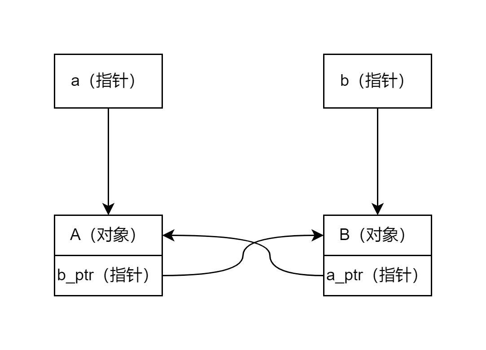

# 12.智能指针

## 为什么要智能指针？
我们直接`new`出来的对象有可能没有正确的释放，如忘记释放、业务上对象可能存在几个时刻需要释放,结果只处理了一部分、遇到异常没有释放等等。

如果只是某一个内存占用不大的对象没有释放，实际上对程序运行也没有什么大问题；
但是当内存占用大的对象没有释放，或者不断制造小的对象且不释放，就可能会产生重大问题。**例如：在服务器上当一个请求到来，我们用new帮它建立一个请求对象，结果处理完请求后忘记释放内存，这就会导致每次来一个请求就会占用一段内存，最终当内存不足时，新请求到来时无法申请得到内存，直接导致服务器的崩溃，这是非常严重的事故。**


为了防止程序内存泄露，我们需要更好的管理内存，我们可以用如下方法更好的管理：
1. C++中提供了智能智能，可以帮我们管理内存，防止内存的泄露。虽然和普通指针相比智能指针性能上可能稍微差一些（只是可能，具体要看情况），但是它一般都可以满足我们的需求，为了安全牺牲微小的性能非常值得。
2. 如果真的有某些对性能要求**非常高**的场景，我们可以使用一些内存回收算法，此时使用普通的`new`而不使用智能指针，来换取性能的提升。（一般我们遇不到这种情况）


综上：我们使用智能指针可以更好的管理内存，防止内存泄露


## C++中的智能指针

C++98 提供了 auto_ptr 模板的解决方案
C++11 增加unique_ptr、shared_ptr 和weak_ptr
C++11 弃用了auto_ptr，在C++11中使用使用auto_ptr可能会报警告或建议。

### auto_ptr

#### 用法
```cpp
//头文件: 
    #include < memory >
//用 法: 
    auto_ptr<类型> 变量名(new 类型)
```

智能指针类型重载了*和->运算符所以可以和一般指针一样使用。
例1
```cpp
#include <iostream>
#include <memory>

using std::cout;
using std::endl;
using std::auto_ptr;

class Test
{
public:
    Test(){cout<<"构造函数"<<endl;}
    void f(){cout<<"其它函数"<<endl;}
    ~Test(){cout<<"析构函数"<<endl;}
};


void fun1()
{
    cout<<"fun1 start"<<endl;
    Test *t = new Test();
    t->f();
    (*t).f();
    cout<<"fun1 end"<<endl<<endl;
}

void fun2()
{
    cout<<"fun2 start"<<endl;
    auto_ptr<Test> t(new Test());
    t->f();        //智能指针类型重载了*和->运算符
    (*t).f();      //所以可以和一般指针一样使用。
    cout<<"fun2 end"<<endl<<endl;
}

int main()
{
    fun1();
    fun2();
    cout<<"all fun end"<<endl<<endl;
    return 0;
}
```

执行结果为：
```
fun1 start
构造函数
其它函数
其它函数
fun1 end

fun2 start
构造函数
其它函数
其它函数
fun2 end

析构函数
all fun end
```
可以发现fun2中的指针自动释放了内存，而fun1中的指针没有。

那么智能指针是不是只要函数结束，就释放当前函数中指针的内存？看例2。

例2
```cpp
#include <iostream>
#include <memory>

using std::cout;
using std::endl;
using std::auto_ptr;

class Test
{
public:
    Test(){cout<<"构造函数"<<endl;}
    void f(){cout<<"其它函数"<<endl;}
    ~Test(){cout<<"析构函数"<<endl;}
};

auto_ptr<Test> fun()
{
    cout<<"t in fun"<<endl;
    auto_ptr<Test> t(new Test());
    t->f();
    cout<<"fun end"<<endl<<endl;
    return t;
}

int main()
{
    auto_ptr<Test> t = fun();
    cout<<"t in main"<<endl;
    t->f();
    cout<<"main end"<<endl<<endl;
    return 0;
}
```
上述代码可能会报出警告，因为auto_ptr进行了赋值，而auto_ptr的赋值都是通过"移动"来实现的，也就是说auto_prt赋值之后等号右边那个指针就失效了，万一左边的指针是左值就可能会出问题，所以会警告，防止用户不知道后果。

执行结果为：
```
t in fun
构造函数
其它函数
fun end

t in main
其它函数
main end

析构函数
```
可以看到智能指针会自己找到合适的位置释放内存，而**不是**当前函数结束就释放内存。

#### 智能指针的常用成员方法

##### get()
get()获取智能指针托管的指针地址
```cpp
auto_ptr<Test> test(new Test);
Test *tmp = test.get();		// 获取指针返回
```


##### release
release() 取消智能指针对动态内存的托管
```cpp
// 定义智能指针
auto_ptr<Test> test(new Test);

Test *tmp2 = test.release();	// 取消智能指针对动态内存的托管
delete tmp2;	// 之前分配的内存需要自己手动释放
```


##### reset
reset() 重置智能指针托管的内存地址，如果地址不一致，原来的会被析构掉
```cpp
// 定义智能指针
auto_ptr<Test> test(new Test);

test.reset();			// 释放掉智能指针托管的指针内存，并将其置NULL

test.reset(new Test());	// 释放掉智能指针托管的指针内存，并将参数指针取代之
```

#### 缺点
1. 复制或者赋值都会改变资源的所有权
2. 在STL容器中使用auto_ptr存在着重大风险，因为容器内的元素必须支持可复制和可赋值
3. 不支持对象数组的内存管理,也就是说不能申请指向数组


### unique_ptr
基于上述缺点C++11中，淘汰了auto_ptr,C++11用更严谨的unique_ptr 取代了auto_ptr

unique_ptr有如下特性
1. 基于排他所有权模式：两个指针不能指向同一个资源
2. 无法进行左值unique_ptr复制构造，也无法进行左值复制赋值操作，但允许临时右值赋值构造和赋值
3. 保存指向某个对象的指针，当它本身离开作用域时会自动释放它指向的对象。
4. 在容器中保存指针是安全的


unique_ptr在使用上基本和auto_ptr一致但是也有自己的不同之处。
#### 禁止左值复制赋值，但允许临时右值复制和赋值
```cpp
unique_ptr<string> p1(new string("I'm Li Ming!"));
unique_ptr<string> p2(new string("I'm age 22."));

p1 = p2;					// 禁止左值赋值
unique_ptr<string> p3(p2);	// 禁止左值赋值构造

unique_ptr<string> p3(std::move(p1));
p1 = std::move(p2);	// 使用move把左值转成右值就可以赋值了，效果和auto_ptr赋值一样
```

#### STL中使用unique_ptr，不允许直接赋值
```cpp
vector<unique_ptr<string>> vec;
unique_ptr<string> p3(new string("I'm P3"));
unique_ptr<string> p4(new string("I'm P4"));

vec.push_back(std::move(p3));
vec.push_back(std::move(p4));

vec[0] = vec[1];	/* 不允许直接赋值 */
vec[0] = std::move(vec[1]);		// 需要使用move修饰，使得程序员知道后果
```

#### 支持对象数组的内存管理
```cpp
// 会自动调用delete [] 函数去释放内存
unique_ptr<int[]> array(new int[5]);	// 支持这样定义
```
除了上面三大项外，unique_ptr的其余用法都与auto_ptr用法一致。


### shared_ptr
但是unique和auto，有时我们把p1转移给p2后，还有可能会用到p1，此时p1已经指向空，这时就会报错。我们此时希望有一种可以共享指向对象的指针，因此C11中提供了shared_ptr

shared_ptr可以使得多个指针指向同一个对象，且shared_ptr可以记录引用特定内存对象的智能指针数量，当复制或拷贝时，引用计数加1，当智能指针析构时，引用计数减1，如果计数为零，代表已经没有指针指向这块内存，那么我们就释放它！这就是 shared_ptr 采用的策略！调用use_count函数可以获得当前托管指针的引用计数。

#### 使用use_count

例
```cpp
#include <iostream>
#include <memory>

using std::cout;
using std::endl;
using std::shared_ptr;

class Test
{
public:
    Test(){cout<<"构造函数"<<endl;}
    void f(){cout<<"其它函数"<<endl;}
    ~Test(){cout<<"析构函数"<<endl;}
};

void f()
{
    shared_ptr<Test> p1(new Test());
    cout<<"p1.use_count():"<<p1.use_count()<<endl;

    shared_ptr<Test> p2(p1);
    cout<<"p1.use_count():"<<p1.use_count()<<endl;
    
    shared_ptr<Test> p3=p1;
    cout<<"p1.use_count():"<<p1.use_count()<<endl;

    p3.reset();//p3指向NULL
    cout<<"p1.use_count():"<<p1.use_count()<<endl;

}
int main()
{
    f();
    return 0;
}
```
程序输出：
```
构造函数
p1.use_count():1
p1.use_count():2
p1.use_count():3
p1.use_count():2
析构函数
```
可以看到每当有赋值或者复制时就会增加计数，而不会产生移动

#### 构造

1. 空的shared_ptr，可以指向类型为T的对象
```cpp
shared_ptr<Person> sp1;
Person *person1 = new Person(1);
sp1.reset(person1);	// 托管person1
```

2. shared_ptr< T > sp2(new T()); 定义shared_ptr,同时指向类型为T的对象

```cpp
shared_ptr<Person> sp2(new Person(2));
shared_ptr<Person> sp3(sp1);
```

3. shared_ptr<T[]> sp4; 空的shared_ptr，可以指向类型为T[]的数组对象 C++17后支持
```cpp
shared_ptr<Person[]> sp4;
```

4. shared_ptr<T[]> sp5(new T[] { … }); 指向类型为T的数组对象 C++17后支持
```cpp
shared_ptr<Person[]> sp5(new Person[5] { 3, 4, 5, 6, 7 });
```

5. shared_ptr< T > sp6(NULL, D()); //空的shared_ptr，接受一个D类型的删除器，使用D释放内存

```cpp
shared_ptr<Person> sp6(NULL, DestructPerson());
```

6. shared_ptr< T > sp7(new T(), D()); //定义shared_ptr,指向类型为T的对象，接受一个D类型的删除器，使用D删除器来释放内存

```cpp
shared_ptr<Person> sp7(new Person(8), DestructPerson());
```

#### 初始化

1. 方式一：构造函数

```cpp
shared_ptr<int> up1(new int(10));  // int(10) 的引用计数为1
shared_ptr<int> up2(up1);  // 使用智能指针up1构造up2, 此时int(10) 引用计数为2
```

2. 方式二：使用make_shared 初始化对象，分配内存效率更高(推荐使用)
make_shared函数的主要功能是在动态内存中分配一个对象并初始化它，返回指向此对象的shared_ptr; 用法：
make_shared<类型>(构造类型对象需要的参数列表);

```cpp
shared_ptr<int> up3 = make_shared<int>(2); // 多个参数以逗号','隔开，最多接受十个
shared_ptr<string> up4 = make_shared<string>("字符串");
shared_ptr<Person> up5 = make_shared<Person>(9);
```


#### 赋值
```cpp
shared_ptrr<int> up1(new int(10));  // int(10) 的引用计数为1
shared_ptr<int> up2(new int(11));   // int(11) 的引用计数为1
up1 = up2;	// int(10) 的引用计数减1,计数归零内存释放，up2共享int(11)给up1, int(11)的引用计数为2
```

#### 主动释放对象
```cpp
shared_ptrr<int> up1(new int(10));
up1 = nullptr ;	// int(10) 的引用计数减1,计数归零内存释放 
// 或
up1 = NULL; // 作用同上 
```

#### 重置
```cpp
p.reset() ; 将p重置为空指针，所管理对象引用计数 减1
p.reset(p1); 将p重置为p1（的值）,p 管控的对象计数减1，p接管对p1指针的管控
p.reset(p1,d); 将p重置为p1（的值），p 管控的对象计数减1并使用d作为删除器
p1是一个指针！
```

#### 交换
p1 和 p2 是智能指针

```
std::swap(p1,p2); // 交换p1 和p2 管理的对象，原对象的引用计数不变
p1.swap(p2);    // 交换p1 和p2 管理的对象，原对象的引用计数不变
```

#### 强引用循环问题
shared_ptr有可能会出现应用循环问题，
例如
```cpp
class A {
public:
    std::shared_ptr<B> b_ptr;
};

class B {
public:
    std::shared_ptr<A> a_ptr;
};

int main() {
    auto a = std::make_shared<A>();
    auto b = std::make_shared<B>();
    a->b_ptr = b;
    b->a_ptr = a;
    return 0;  // 程序结束，a 和 b 所占用的内存没有被正确释放，造成内存泄漏
}
```

此时我们发现这是一个神奇的结构


如上图：当我们想释放a指向的A对象时，我们就需要去释放b_ptr指向的B对象；而释放B对象就要去释放a_ptr指向的A对象；而释放A对象，我们又要去释放b_ptr指向的B对象。这样就会永无止境的循环下去，导致内存无法释放，导致内存泄露。


### weak_ptr
为了解决shared_ptr的循环引用问题，C++11中又提供了weak_ptr来辅助shared_ptr解决这一问题。

weak_ptr有如下特点：
1. weak_ptr只可以从一个 shared_ptr 或另一个 weak_ptr 对象构造。
2. 构造了weak_ptr不会引起weak_ptr或者shared_ptr引用计数的增加。
3. weak_ptr 没有重载*和->，但可以使用 lock 获得一个可用的 shared_ptr 对象。注意：此时若有变量接收，则计数会增加


#### 解决引用循环问题
```cpp
#include <iostream>
#include <memory>

using std::cout;
using std::endl;
using std::weak_ptr;
using std::shared_ptr;

class A;
class B;

class A {
public:
    A(){cout<<"A构造函数"<<endl;}
    ~A(){cout<<"A析构函数"<<endl;}
    std::shared_ptr<B> b_ptr;
};

class B {
public:
    B(){cout<<"B构造函数"<<endl;}
    ~B(){cout<<"B析构函数"<<endl;}
    std::weak_ptr<A> a_ptr;   // 使用 weak_ptr 解决循环引用问题
};

int main() {
    auto a = std::make_shared<A>();
    auto b = std::make_shared<B>();

    a->b_ptr = b;
    b->a_ptr = a;

    return 0;  
}
```

输出结果
```
A构造函数
B构造函数
A析构函数
B析构函数
```
可以看出A、B成功被释放了

#### 赋值和使用lock

```cpp
#include <iostream>
#include <memory>

using std::cout;
using std::endl;
using std::weak_ptr;
using std::shared_ptr;

int main() {
    shared_ptr<int> sp1(new int(10));

    weak_ptr<int> wp1(sp1);
    cout<< "sp1.use_count() = "<<sp1.use_count()<<endl;
    cout<< "wp1.use_count() = " << wp1.use_count() << endl << endl;

    weak_ptr<int> wp2 = wp1;
    cout<< "sp1.use_count() = "<<sp1.use_count()<<endl;
    cout<< "wp1.use_count() = " << wp1.use_count() << endl << endl;

    weak_ptr<int> wp3 = sp1;
    cout<< "sp1.use_count() = "<<sp1.use_count()<<endl;
    cout<< "wp1.use_count() = " << wp1.use_count() << endl << endl;
    
    shared_ptr<int> sp2 = wp1.lock();
    cout<< "sp1.use_count() = "<<sp1.use_count()<<endl;
    cout<< "wp1.use_count() = " << wp1.use_count() << endl << endl;
    
    return 0;  
}
```

结果
```
sp1.use_count() = 1
wp1.use_count() = 1

sp1.use_count() = 1
wp1.use_count() = 1

sp1.use_count() = 1
wp1.use_count() = 1

sp1.use_count() = 2
wp1.use_count() = 2
```
可以看出创建weak_ptr不增加引用计数，但是通过weak_ptr的lock创建出shared_ptr被接收后，就会增加引用计数，且weak_ptr的数量就是指向shared_ptr的数量


#### expired 

在 C++11 中，weak_ptr 类型提供了一个成员函数 expired()，用于检查 weak_ptr 是否过期。当 shared_ptr 对象被销毁时，与之相关的 weak_ptr 对象就会变成“过期”的状态，此时调用 expired() 函数会返回 true；否则，expired() 函数返回 false。

例子：
```cpp
#include <iostream>
#include <memory>

int main() 
{
    std::shared_ptr<int> p(new int(42));
    std::weak_ptr<int> wp(p);
    
    if (wp.expired()) 
        std::cout << "object has been destroyed" << std::endl;
    else 
        std::cout << "object still exists" << std::endl;
    
    p.reset();
    
    if (wp.expired())
        std::cout << "object has been destroyed" << std::endl;
    else 
        std::cout << "object still exists" << std::endl;
}
```

执行结果：
```
object still exists
object has been destroyed
```


## 注意事项
1. 不要把一个原生指针给多个智能指针管理;
```cpp
int *x = new int(10);
unique_ptr< int > up1(x);
unique_ptr< int > up2(x);
// 警告! 以上代码使up1 up2指向同一个内存,非常危险
或以下形式：
up1.reset(x);
up2.reset(x);
```

2. 记得使用u.release()的返回值;
在调用u.release()时是不会释放u所指的内存的，这时返回值就是对这块内存的唯一索引，如果没有使用这个返回值释放内存或是保存起来，这块内存就泄漏了.

3. 禁止delete 智能指针get 函数返回的指针;
如果我们主动释放掉get 函数获得的指针，那么智能 指针内部的指针就变成野指针了，析构时造成重复释放，带来严重后果!

4. 禁止用任何类型智能指针get 函数返回的指针去初始化另外一个智能指针！
```cpp
shared_ptr< int > sp1(new int(10));
// 一个典型的错误用法 shared_ptr< int > sp4(sp1.get());
```

5. 避免shared_ptr的循环引用：智能指针会自动管理对象的内存，但如果多个智能指针对象互相引用，可能会导致循环引用，从而导致内存泄漏。为避免这种情况，应该使用弱指针（weak_ptr）或者手动解除引用。

6. 在多线程环境下注意线程安全，这些智能指针都不是线程安全的。尤其是shared_ptr和weak_ptr引用计数是共享的，它们的线程安全问题比unique_ptr更复杂一些，具体参看《Linux多线程服务端编程：使用muduo%20C++网络》-(陈硕)中的1.9节，这里不再赘述。


## 本文参考文章
*  [《C++ 智能指针 - 全部用法详解》-CSDN-cpp_learners](https://blog.csdn.net/cpp_learner/article/details/118912592)