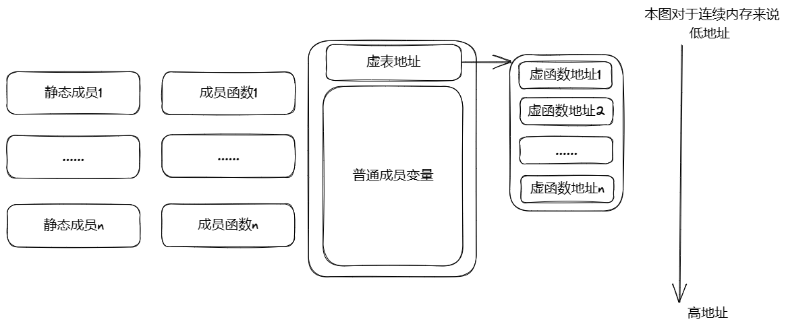
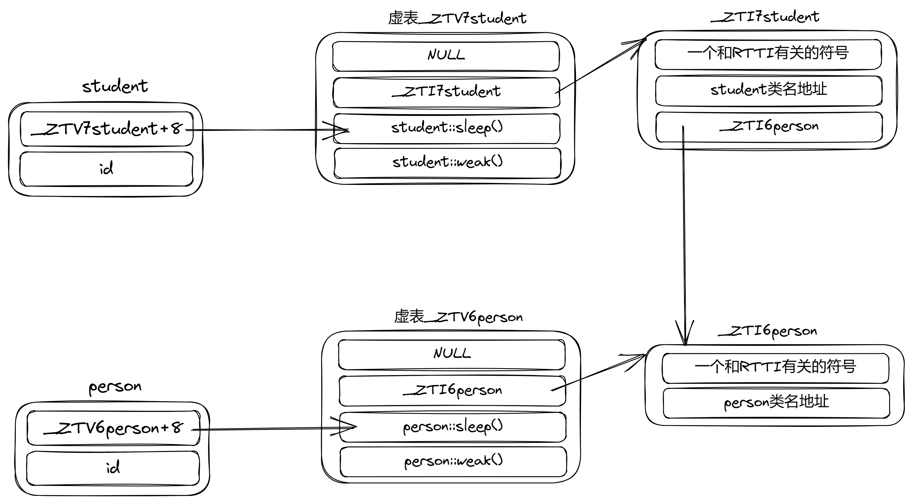
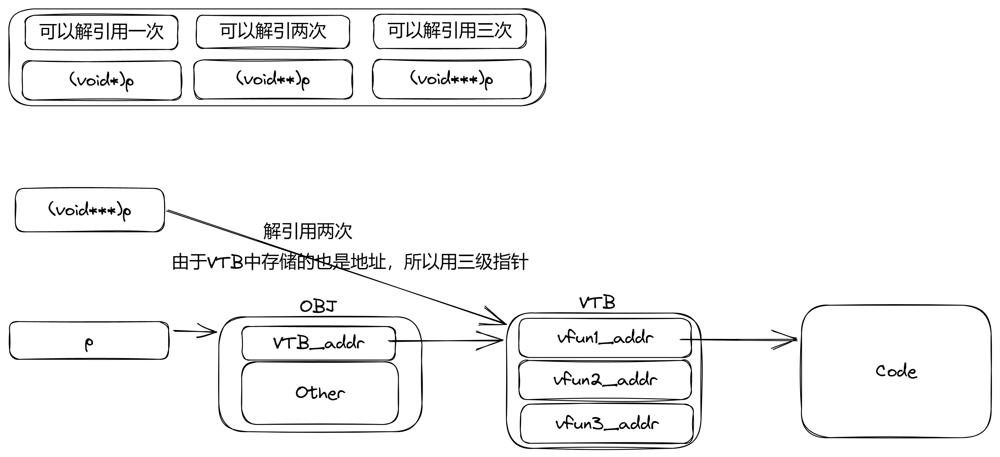
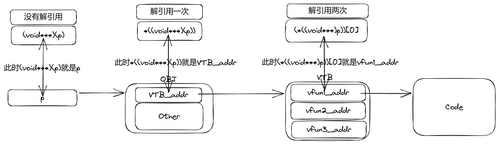

# 13. 对象模型(主要说虚函数)与RTTI

注意：本节需要一些汇编功底

## 对象模型
### 基本概念
对象模型就是**指对象再内存中是怎么进行存储的，它的数据结构是什么样的，这里的数据结构不仅指对象的成员，还指C++为这个对象创建的、其它的、用于这个对象相关操作的数据结构。它们共同构成了C++的对象模型**。像成员函数、虚表、数据成员等等都是对象模型的一部分，它们共同为这个对象服务。


C++对象模型大致如下图：


注意，上图中在同一个框中的内存是连续的，否则是不连续的。且上图是以g++为基础绘制，不同编译器存在可能不同的实现方式，导致模型不同。


### 虚函数与虚函数表
#### 虚函数初步
虚函数是主要是为了实现多态而引入的，所以要先说一下多态。

**多态指的是某个类中的子类们，在进行同一动作时而表现出的不同行为。** 比如人这个类，下面有两个子类，老师和学生，这两个类在进行同一动作时例如睡觉，会表现出不同行为，比如老师10点睡觉，学生12点睡觉。也就是说虽然老师和学生都属于人这个类，且他们都有睡觉这个动作，但是进行这个动作时他们的具体的行为是不同的。**换到编程中说多态就是就是子类中同一函数的多种状态。而C++中多态最核心的两个就是虚函数以及父类指针指向子类对象**。


通过虚函数，我们可以让父类指针指向子类对象的时候，仍然调用子类的虚函数。
例如，有如下代码：

```cpp
#include<iostream>
using namespace std;

class person
{
private:
    int id;
public:
    person(int _id):id(_id){};
    virtual void sleep(){cout<<"this is person sleep"<<endl;}
    virtual void weak(){cout<<"this is person weak"<<endl;}
};

class student:public person
{
public:
    student(int _id):person(_id){};
    virtual void sleep(){cout<<"this is student sleep"<<endl;}
    virtual void weak(){cout<<"this is student weak"<<endl;}
};

int main()
{
    person *p = new student(10);//父类指针指向子类对象
    p->sleep();
    p->weak();
}
```

执行结果：
```
this is student sleep
this is student weak
```
很明显我们的C++自动的识别出我们的对象是子类student，而不是父类person。这就要归功于我们的虚函数。

#### 虚函数原理
对于虚函数的原理，我们可以根据其汇编语言来进行分析。
以下汇编代码，是上述C++代码在[godbolt](https://www.godbolt.org/)下使用x86-64 gcc 12.2编译器，通过添加选项`-m32 -std=c++11 -O0`获得。

```asm
_ZN6personC2Ei:             ;person的构造函数
        push    ebp
        mov     ebp, esp    ;建立函数栈
        
        mov     edx, OFFSET FLAT:_ZTV6person+8    
        mov     eax, DWORD PTR [ebp+8]   
        mov     DWORD PTR [eax], edx    ;把虚函数表地址放到对象头部
        
        mov     eax, DWORD PTR [ebp+8]
        mov     edx, DWORD PTR [ebp+12]
        mov     DWORD PTR [eax+4], edx;把成员变量id放在虚表后
        
        nop
        pop     ebp
        ret
        

.LC0:
        .string "this is person sleep"
_ZN6person5sleepEv:        ;person的虚函数sleep
        push    ebp
        mov     ebp, esp
        sub     esp, 8
        sub     esp, 8
        push    OFFSET FLAT:.LC0
        push    OFFSET FLAT:_ZSt4cout
        call    _ZStlsISt11char_traitsIcEERSt13basic_ostreamIcT_ES5_PKc
        add     esp, 16
        sub     esp, 8
        push    OFFSET FLAT:_ZSt4endlIcSt11char_traitsIcEERSt13basic_ostreamIT_T0_ES6_
        push    eax
        call    _ZNSolsEPFRSoS_E
        add     esp, 16
        nop
        leave
        ret
.LC1:
        .string "this is person weak"
        
        
_ZN6person4weakEv:         ;person的虚函数weak
        push    ebp
        mov     ebp, esp
        sub     esp, 8
        sub     esp, 8
        push    OFFSET FLAT:.LC1
        push    OFFSET FLAT:_ZSt4cout
        call    _ZStlsISt11char_traitsIcEERSt13basic_ostreamIcT_ES5_PKc
        add     esp, 16
        sub     esp, 8
        push    OFFSET FLAT:_ZSt4endlIcSt11char_traitsIcEERSt13basic_ostreamIT_T0_ES6_
        push    eax
        call    _ZNSolsEPFRSoS_E
        add     esp, 16
        nop
        leave
        ret
        

_ZN7studentC2Ei:            ;student的构造函数
        push    ebp
        mov     ebp, esp
        sub     esp, 8      ;建栈，并分配栈空间
        
        mov     eax, DWORD PTR [ebp+8]
        sub     esp, 8
        push    DWORD PTR [ebp+12]
        push    eax
        call    _ZN6personC2Ei
        add     esp, 16      ;在this指针位置，调用person的构造函数
        
        mov     edx, OFFSET FLAT:_ZTV7student+8
        mov     eax, DWORD PTR [ebp+8]
        mov     DWORD PTR [eax], edx;修改this指针位置的虚函数表地址为student的虚函数表地址
        
        nop
        leave
        ret
        

.LC2:
        .string "this is student sleep"
_ZN7student5sleepEv:        //student的sleep函数
        push    ebp
        mov     ebp, esp
        sub     esp, 8
        sub     esp, 8
        push    OFFSET FLAT:.LC2
        push    OFFSET FLAT:_ZSt4cout
        call    _ZStlsISt11char_traitsIcEERSt13basic_ostreamIcT_ES5_PKc
        add     esp, 16
        sub     esp, 8
        push    OFFSET FLAT:_ZSt4endlIcSt11char_traitsIcEERSt13basic_ostreamIT_T0_ES6_
        push    eax
        call    _ZNSolsEPFRSoS_E
        add     esp, 16
        nop
        leave
        ret
        

.LC3:
        .string "this is student weak"
_ZN7student4weakEv:                //student的weak函数
        push    ebp
        mov     ebp, esp
        sub     esp, 8
        sub     esp, 8
        push    OFFSET FLAT:.LC3
        push    OFFSET FLAT:_ZSt4cout
        call    _ZStlsISt11char_traitsIcEERSt13basic_ostreamIcT_ES5_PKc
        add     esp, 16
        sub     esp, 8
        push    OFFSET FLAT:_ZSt4endlIcSt11char_traitsIcEERSt13basic_ostreamIT_T0_ES6_
        push    eax
        call    _ZNSolsEPFRSoS_E
        add     esp, 16
        nop
        leave
        ret
        

main:
        lea     ecx, [esp+4]
        and     esp, -16
        push    DWORD PTR [ecx-4]
        push    ebp
        mov     ebp, esp    ;建栈
        
        push    ebx
        push    ecx
        sub     esp, 16     ;分配栈空间
        
        sub     esp, 12    
        push    8
        call    _Znwj
        add     esp, 16     ;调用new分配空间
        
        mov     ebx, eax
        sub     esp, 8
        push    10
        push    ebx
        call    _ZN7studentC1Ei;使用new分配出的空间构造student对象
        add     esp, 16     
        mov     DWORD PTR [ebp-12], ebx ;把对象地址放到变量p中
        
        mov     eax, DWORD PTR [ebp-12]    ;取变量p,也是对象的this指针
        mov     eax, DWORD PTR [eax]       ;取变量p所指向的地址，也就是虚表地址
        mov     eax, DWORD PTR [eax]       ;取出虚函数表中第一项，也就是sleep
        sub     esp, 12
        push    DWORD PTR [ebp-12]         ;压入this指针
        call    eax                        ;调用sleep函数
        add     esp, 16        
        
        mov     eax, DWORD PTR [ebp-12]    ;取变量p
        mov     eax, DWORD PTR [eax]       ;取变量p所指向的地址，也就是虚表地址
        add     eax, 4                     ;虚表地址向后偏移4，也就是指向虚表的第二项
        mov     eax, DWORD PTR [eax]       ;取出虚函数表地址的第二项也就是weak
        sub     esp, 12
        push    DWORD PTR [ebp-12]         ;压入this指针
        call    eax                        ;调用sleep函数
        add     esp, 16
        
        mov     eax, 0
        lea     esp, [ebp-8]
        pop     ecx
        pop     ebx
        pop     ebp
        lea     esp, [ecx-4]
        ret
        

_ZTV7student:                     ;student的虚表
        .long   0                 ;起始为空
        .long   _ZTI7student      ;为student类型表，与RTTI有关，或者叫类型信息块（Type Information Block，TIB）
        .long   _ZN7student5sleepEv    ;从此处开始是student的虚函数表，也就是_ZTV7student+8，此处记录了两个函数sleep和weak
        .long   _ZN7student4weakEv
        

_ZTV6person:                       ;person的虚表
        .long   0
        .long   _ZTI6person        ;person的类型表
        .long   _ZN6person5sleepEv ;从此处开始是person的虚函数表，也就是_ZTV6person+8
        .long   _ZN6person4weakEv
        

_ZTI7student:    ;student类型信息表
        .long   _ZTVN10__cxxabiv120__si_class_type_infoE+8;是C++运行时库的一个符号，是一个类和RTTI有关
        .long   _ZTS7student    ;记录本对象的类的类名
        .long   _ZTI6person     ;记录父类的类型信息表
        

_ZTS7student:
        .string "7student"      ;student对象类名


_ZTI6person:
        .long   _ZTVN10__cxxabiv117__class_type_infoE+8
        .long   _ZTS6person      ;记录本对象的类的类名


_ZTS6person:
        .string "6person"        ;person对象类名


_Z41__static_initialization_and_destruction_0ii:
        push    ebp
        mov     ebp, esp
        sub     esp, 8
        cmp     DWORD PTR [ebp+8], 1
        jne     .L11
        cmp     DWORD PTR [ebp+12], 65535
        jne     .L11
        sub     esp, 12
        push    OFFSET FLAT:_ZStL8__ioinit
        call    _ZNSt8ios_base4InitC1Ev
        add     esp, 16
        sub     esp, 4
        push    OFFSET FLAT:__dso_handle
        push    OFFSET FLAT:_ZStL8__ioinit
        push    OFFSET FLAT:_ZNSt8ios_base4InitD1Ev
        call    __cxa_atexit
        add     esp, 16
.L11:
        nop
        leave
        ret
_GLOBAL__sub_I_main:
        push    ebp
        mov     ebp, esp
        sub     esp, 8
        sub     esp, 8
        push    65535
        push    1
        call    _Z41__static_initialization_and_destruction_0ii
        add     esp, 16
        leave
        ret
```

根据上述汇编语言分析，我们可以得出person和student的模型大致如下图



总结一下，每个对象都有自己的虚函数表，且这个虚函数表的地址就在对象内存的最前面，这个虚函数表指向虚表中偏移为8（对32位机来说是8，对64位来说可能就是16了）的位置，虚表中前两项一项为空，另一项指向类型表，类型表中包含了一些与RTTI有关的信息。


#### 获取虚函数

那么我们如何在C++中拿到某个对象的虚函数的地址，然后调用它呢？
有如下方案

##### 方法一
三级指针一解引用取表法。

通过让p成为三级指针，对其进行一次解引用（也就是间接寻址），可以获取虚函数表地址，然后再一次引用就可以得到函数地址了。实际上是解了两次引用，但最关键的还是第一次解引用获取虚函数表地址，所以我称之为“三级指针一解引用取表法”简称“**三指一解取表**”。

*解引用：就是用\*获取所指地址位置的值*


代码如下：
```cpp
#include<iostream>

using namespace std;

class person
{
private:
    int id;
public:
    person(int _id):id(_id){};
    virtual void sleep(){cout<<"this is person sleep"<<endl;}
    virtual void weak(){cout<<"this is person weak"<<endl;}
};

class student:public person
{
public:
    student(int _id):person(_id){};
    virtual void sleep(){cout<<"this is student sleep"<<endl;}
    virtual void weak(){cout<<"this is student weak"<<endl;}
};


int main()
{
    person *p = new student(10);
    void (*f)() = (void (*)()) ((*((void***)(p)))[0]);
    void (*g)() = (void (*)()) ((*((void***)(p)))[1]);
    f();
    g();
}
```

结果为：
```
this is student sleep
this is student weak
```

先解释一下为什么要用三级指针：当我们知道对象地址p时，我们要先在p中找到虚函数表地址，然后再在虚函数表中找到虚函数的地址。这需要进行两次解引用（也就是寻址），而且我们最后得到的函数地址也是一个指针，所以总共有三级。**总结一下，我们需要通过两次解引用找到虚函数地址，且虚函数地址本身也是一个地址，所以我们需要三级指针。**



明显关键步骤就是,这个东西`(void (*)()) ((*((void***)(p)))[0])`

我们将其拆分成几个部分来看：
```cpp
(void***)(p)       //将p强制转化为三级指针,使其可以被解引用两次后还是一级指针
(*((void***)(p)))  //对p解引用1次，得到了虚表地址，也就是说(*((void***)(p)))就是虚表地址，看成数组就是虚表首地址，此处就是三指一解取表
(*((void***)(p)))[0]//虚表地址直接当做数组用，取出虚表中第一个函数地址，此处也进行了解引用
(void (*)()) ((*((void***)(p)))[0])//将函数地址转化为对应的函数指针
```




##### 方法二

一步一步取地址，然后再根据地址取地址，最后得到虚函数
```cpp
#include<iostream>
using namespace std;

class person
{
private:
    int id;
public:
    person(int _id):id(_id){};
    virtual void sleep(){cout<<"this is person sleep"<<endl;}
    virtual void weak(){cout<<"this is person weak"<<endl;}
};

class student:public person
{
public:
    student(int _id):person(_id){};
    virtual void sleep(){cout<<"this is student sleep"<<endl;}
    virtual void weak(){cout<<"this is student weak"<<endl;}
};


int main()
{
    person *p = new student(10);
    #ifdef __x86_64__
        void (*f)() = (void (*)()) (*(unsigned long long*)((*(unsigned long long*)p)));    
        void (*g)() = (void (*)()) (*(unsigned long long*)((*(unsigned long long*)p)+sizeof(unsigned long long)));
    #else
        void (*f)() = (void (*)()) (*(unsigned long*)((*(unsigned long*)p)));    
        void (*g)() = (void (*)()) (*(unsigned long*)((*(unsigned long*)p)+sizeof(unsigned long)));
    #endif
    f();
    g();
}
```

为什么使用`unsigned long`和`unsigned long long`类型，因为虽然一般情况下`unsigned long`长度和机器字长相等，但是在部分编译器`unsigned long`长度就是4字节，无论机器字长是多少，都是4字节；这就会导致错误，因为当在64位机上时表中的长度是8字节所以为了兼容这些编译器，通过宏进行判断。
上述代码仅在g++中编译通过，并运行结果正确，而在clang++中不一定成功，可能是宏不兼容的原因。


我们讲解一下32位下的`void (*g)() = (void (*)()) (*(unsigned long*)((*(unsigned long*)p)+sizeof(unsigned long)));`

同样分步骤讲解
```cpp
//先把p转化为unsigned long*类型的指针
(unsigned long*)p

//在p的位置取出unsigned long长度的数据，也就是虚表地址，或者叫虚表首地址
*(unsigned long*)p

//在首地址位置获取下一个表项的地址，也就是表中的第二项，此地址中含有weak的地址
((*(unsigned long*)p)+sizeof(unsigned long))

//在下一个表项的地址的位置取出unsigned long长度的数据，也就是weak的地址
(*(unsigned long*)((*(unsigned long*)p)+sizeof(unsigned long)))

//把函数地址进行转化，转化为对应的函数指针
(void (*)()) (*(unsigned long*)((*(unsigned long*)p)+sizeof(unsigned long)))
```

方法二在兼容性上存在问题，此处只是为了演示原理
在实际工程中使用时，应当使用方法一，方法一的兼容性更好一些，因为方法二使用了的宏是依赖于特定平台的，而方法一是纯粹的C语法，所以方法一更加兼容不同的平台。

## RTTI
RTTI(Runtime Type Identification)是运行阶段类型识别
C++中通过有三个元素支持RTTI，分别是dynamic_cast、type_id、type_info
对这些元素的支持，可我们虚表中的类型表息息相关，具体原理比较复杂，此处不探讨，我们主要看看如何使用这些元素。


### dynamic_cast
#### 用法

`dynamic_cast`用于指针类型的转换，**一般用于指针的安全的下行转换**
此处解释一下**下行转换**和**上行转换**，我们把父类看做最上层，子类看做下层，那么**下行转换**就很好理解了，就是把父类指针转换为子类指针，**上行转换**就是把子类指针转换为父类指针。**上行下行**都是相对于指针类型来说的，不要和指针实际指向的对象类型混淆。

由于一般情况下子类对象就是一种特殊的父类对象，所以进行上行转换的都是合法的，但是下行转换却不一定。所以`dynamic_cast`可以安全的进行下行转换，当然也可以上行转换。

用法为`dynamic_cast<Type*>(p)`，此式子会检查`p`实际指向的对象是不是`Type`类型或者是`Type`的子类，如果是就返回一个`Type`类型的指针，否则返回`NULL`。也就是说`p`指向的对象只能是`Type`或者是`Type`的子类才可以转换。

上面的规则，有的人看上去觉得：很像是上行转换，因为`p`指向的对象只能是`Type`或者是`Type`的子类，而`Type`不是在`p`上吗，那不应该是上行转化吗？但是我们说**上行下行都是相对于指针类型来说的，不要和指针实际指向的对象类型混淆。**
例如：`Cat`继承于`Animal`，现在有指针`Animal *ani`指向一个`Cat`，通过`dynamic_cast<Cat*>(ani)`,发现`ani`实际指向的是一个`Cat`，所以可以进行转换，可以看出我们把`Animal`转换为`Cat`也就是下行转换。所以之所以看上去像上行转化，是因为我们可能会把**p指针实际指向的对象类型和Type指针类型混淆**，p指向的**对象的类型**只能是`Type`本类或者子类，而p的**指针类型**却有可能是Type的父类指针。
所以我们要注意三点：
**1. 源指针类型
2. 源指针指向的对象的类型
3. 目标指针类型**
明确了这三点，我们可以通过**比较1和3，知道是上行还是下行转换**；通过**比较2和3知道能不能转换成功**。


#### 例子

例1：
```cpp
#include <iostream>
#include <string>

using namespace std;

class Animal
{
protected:
    string name;
public:
    Animal(const char* s):name(s){};
    virtual ~Animal(){};
    virtual void eat(){cout<<"This Animal "<<this->name<<" start eating."<<endl;}
};

class Cat:public Animal
{
public:
    Cat(const char* s):Animal(s){};
    ~Cat(){};
    void eat() override {cout<<"This Cat "<<this->name<<" start eating."<<endl;}
};


int main()
{
    Animal* pa = new Cat("Cat6");
    pa->eat();
    
    Cat* pc = dynamic_cast<Cat*>(pa);
    pc->eat();

    delete pa;
    return 0;
}
```
运行结果：
```
This Cat Cat6 start eating.
This Cat Cat6 start eating.
```

此代码展示了一个父类指针（Animal* pa）向子类指针（Cat* pc）的下行转换。也就是所把父类指针转成了子类指针。假如Cat中有其它接口，这样做我们就可以调用Cat中特有的接口。

例2：可以配合if用来判断类型
```cpp
#include <iostream>
using namespace std;

class Animal 
{
public:
    virtual void eat() { cout << "Animal is eating." << endl; }
    virtual ~Animal(){};
};

class Cat : public Animal 
{
public:
    //Cat类特有的函数
    void meow() { cout << "Meow~" << endl; }
};

class Dog : public Animal 
{
public:
    //Dog类特有的函数
    void bark() { cout << "Woof!" << endl; }
};

void feed(Animal* animal) 
{
    // 注意Cat* cat = dynamic_cast<Cat*>(animal)
    // 如果转化不成功，这个式子的值就是NULL，那么对应的if语句也就不会执行
    // 因此dynamic_cast配合if同样可以识别类型
    // 也就是说当指针实际指向Cat对象时，才会进入对应于Cat的位置执行
    if (Cat* cat = dynamic_cast<Cat*>(animal)) 
        cat->meow();
    else if (Dog* dog = dynamic_cast<Dog*>(animal))
        dog->bark();
    else
        animal->eat();
}

int main() 
{
    Animal* animal = new Dog();
    feed(animal);
    delete animal;
  
    animal = new Cat();
    feed(animal);
    delete animal;

    animal = new Animal();
    feed(animal);
    delete animal;

    return 0;
}
```
通过配合if，根据自身的返回值就可以知道转换是否成功，然后进行类型的判断。

运行结果：
```
Woof!
Meow~
Animal is eating.
```

### type_id 和 type_info

`typeid(obj)`或者`typeid(class)`可以获得一个`type_info`对象，但是这个对象是不可以复制和构造的，在语法上要使用`const type_info &`类型来定义一个对象。
`type_info`对象有`name()`方法，可以返回一个`const char*`静态字符串。
type_info对象可以用`==`和`!=`进行比较

当使用name()和类型比较时要加入`<type_info>`头文件。
`#include <typeinfo>`

若对象为空，`type_id()`会触发一个`bad_typeid`异常。


例：
```cpp
#include <iostream>
#include <typeinfo>

using namespace std;

class Base
{
protected:
    int num;
public:
    Base(int arg_num):num(arg_num){};
};


class Sub:public Base
{
public:
    Sub(int arg_num):Base(arg_num){};
};


int main()
{
    cout<<"Base type name: "<<typeid(Base).name()<<endl;
    cout<<"Sub type name: "<<typeid(Sub).name()<<endl;
    cout<<"Base Pointer type name: "<<typeid(Base*).name()<<endl;
    cout<<"Sub Pointer type name: "<<typeid(Sub*).name()<<endl<<endl;//输出类型名称
    
    Base *p1 = new Base(10);
    Base *p2 = new Sub(10);
    Sub *p3 = new Sub(10);

    const type_info& type_p1 = typeid(p1);//需要用const type_info& 类型接收
    const type_info& type_p2 = typeid(p2);

    if(type_p1 == type_p2) //比较类型id
        cout<<"p1's and p2's type are same"<<endl;
    else
        cout<<"p1's and p2's type are different"<<endl;

    if(typeid(p2) == typeid(p3))
        cout<<"p2's and p3's type are same"<<endl;
    else
        cout<<"p2's and p3's type are different"<<endl<<endl;

    cout<<"p1's type: "<<typeid(p1).name()<<endl;//输出类型名称
    cout<<"p2's type: "<<typeid(p2).name()<<endl;
    cout<<"p3's type: "<<typeid(p3).name()<<endl;
    
    return 0;
}
```

运行结果：
```
Base type name: 4Base
Sub type name: 3Sub
Base Pointer type name: P4Base
Sub Pointer type name: P3Sub

p1's and p2's type are same
p2's and p3's type are different

p1's type: P4Base
p2's type: P4Base
p3's type: P3Sub
```


## RTTI进阶参考文章

* [《C++ RTTI 实现原理详解》-CSDN-xdesk](https://blog.csdn.net/xiangbaohui/article/details/109231333)